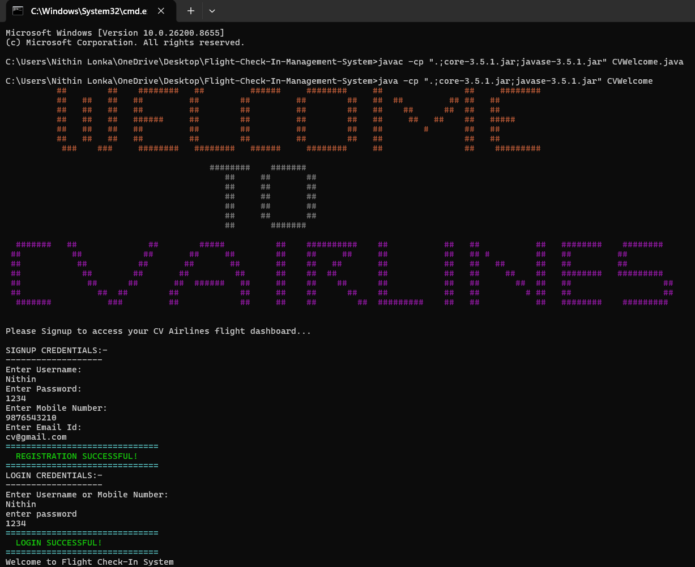
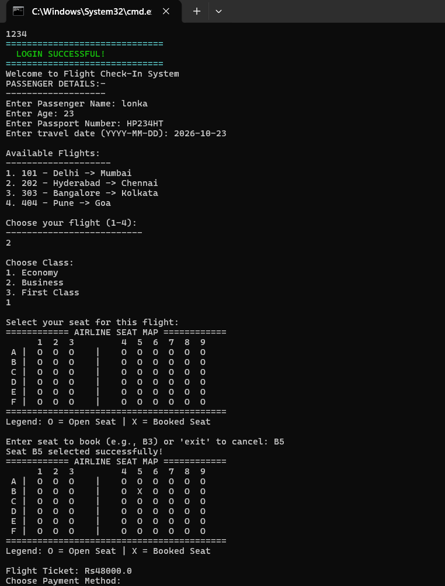
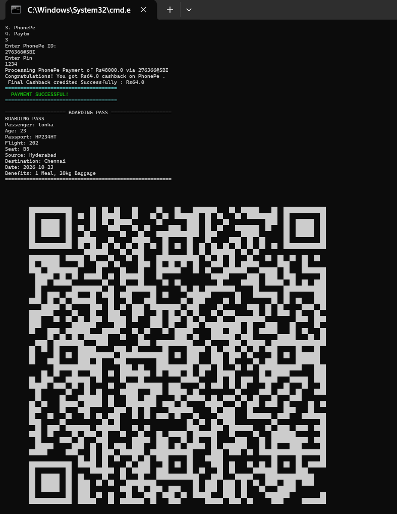

# ✈️ Flight Check-In Management System

A **console-based Flight Check-In Management System** developed using **Core Java**. This application simulates the airline check-in process by allowing passengers to register, log in, select flights, book seats, make payments, and generate QR code-based boarding passes.

---

## 📌 Features

- 👤 Passenger Registration
- 🔐 Login Authentication
- 🔑 Forgot Password with OTP Verification
- 🛫 Flight Selection
- 💺 Seat Allocation using 2D Arrays
- 🎫 Boarding Pass Generation
- 📱 QR Code Generation using ZXing Library
- 💳 Payment Simulation
  - Credit Card
  - UPI
  - PhonePe
  - Paytm
- ❌ Ticket Cancellation
- ⚠️ Input Validation
- 🛡️ Exception Handling
- 🎨 Interactive Console Interface
- 🧩 Object-Oriented Programming Concepts

---

## 🛠️ Technologies Used

- Java
- Core Java
- Object-Oriented Programming (OOP)
- Arrays & 2D Arrays
- Exception Handling
- ZXing Library (QR Code Generation)

---

## 📂 Project Structure

```
Flight-Check-In-Management-System
│
├── CVWelcome.java
├── AirlineSeats.java
├── FlightCheckIn.java
├── Payments.java
├── ConsoleBoardingPassQR.java
├── StyledLoginAnimation.java
├── StyledSignupAnimation.java
├── BlinkingPaymentMessage.java
├── date.java
├── core-3.5.1.jar
├── javase-3.5.1.jar
├── README.md
└── screenshots
    ├── welcome-login.png
    ├── flight-booking.png
    └── boarding-pass.png
```

---

## 🚀 How to Compile

### Windows

```bash
javac -cp ".;core-3.5.1.jar;javase-3.5.1.jar" CVWelcome.java
```

---

## ▶️ How to Run

### Windows

```bash
java -cp ".;core-3.5.1.jar;javase-3.5.1.jar" CVWelcome
```

---

## 📸 Screenshots

### 🔹 Welcome & Login



---

### 🔹 Flight Selection & Seat Booking



---

### 🔹 Boarding Pass with QR Code



---

## 💡 Concepts Demonstrated

- Object-Oriented Programming (OOP)
- Encapsulation
- Inheritance
- Polymorphism
- Abstraction
- Interfaces
- Exception Handling
- Arrays and 2D Arrays
- User Authentication
- Payment Processing Simulation
- QR Code Generation
- Console-Based Application Development

---

## 🔮 Future Enhancements

- Database integration using MySQL
- Admin Dashboard
- Java Swing / JavaFX GUI
- Online Payment Gateway Integration
- Email/SMS Ticket Confirmation
- Multi-user Support

---

## 👨‍💻 Author

**Nithin Lonka**

GitHub: https://github.com/lonkanithin

---

⭐ If you found this project interesting, feel free to fork it or leave a star!